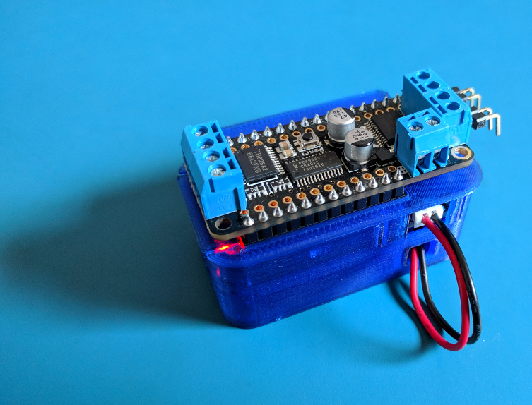
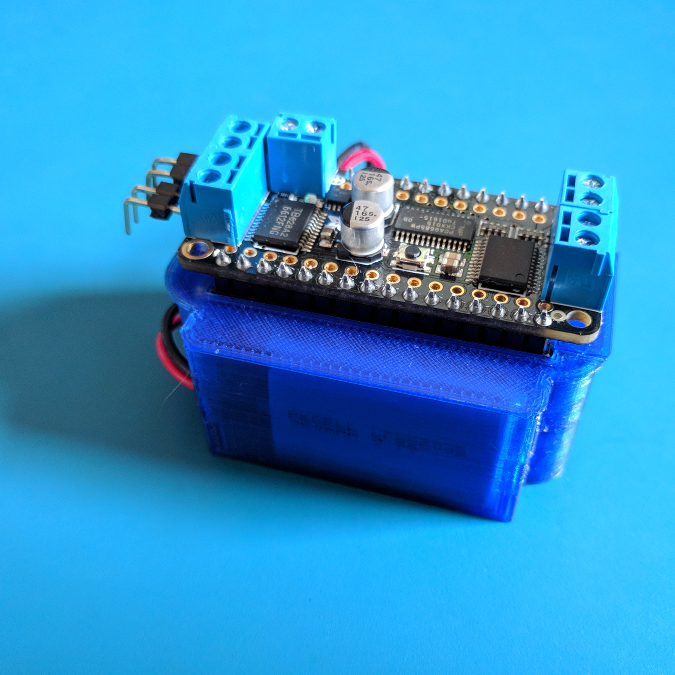
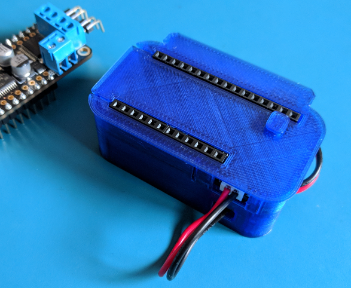
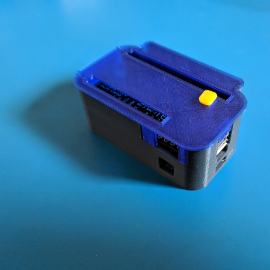
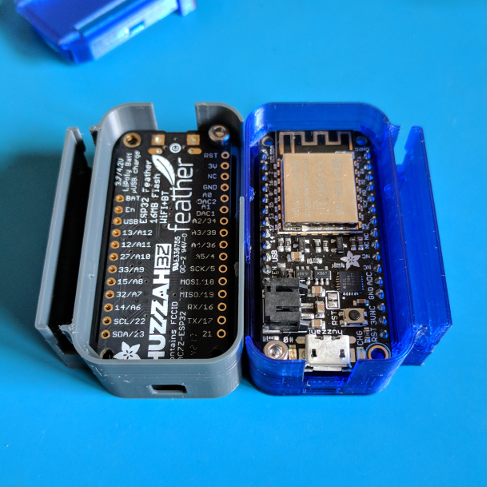
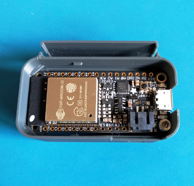
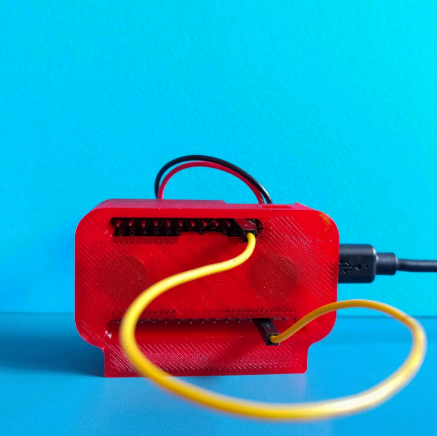

# Magnetic Feather Case

A case that sticks with you. Designed for [Adafruit's Feather series](https://learn.adafruit.com/adafruit-feather/overview). 
Flexible enough to use from development to deployment.

### Features

* Optional compartment for a 350mAh LiPoly battery (with a zip-tie strain relief slot)

* Slot for a rare earth badge magnet (source provided)

* Support for Adafruit's stackable Feather wings

* Cable management and routing slots

* Upside down board support (battery version only)

### Materials Required

#### Feather + Screws

* 1x Adafruit Feather (ESP8266, Bluefruit, ESP32, Adalogger 32u4 were used during prototyping/building)

* 2x M2.5 x 6mm socket head cap screw (source: [Trimcraft Aviation RC](https://www.trimcraftaviationrc.com/index.php?route=product/product&product_id=182) )

#### Battery (optional)

* 1x Lithium Ion Polymer Battery - 3.7v 350mAh 552035 - [PKCell 552035, Adafruit](https://www.adafruit.com/product/2750). There are shipping restrictions on lithium polymer batteries, so a local source with the same model/dimensions might be more suitable.

#### Magnet

* 1x Badge Magnet - [Amazon 10-pack](https://www.amazon.com/totalElement-Magnetic-Fastener-Adhesive-10-Pack/dp/B00EHK287M) -- the one [sold by Adafruit is tested as well](https://www.adafruit.com/product/1170)

### Printing

Print these parts:

* 1x - Case (choose between the battery and non-battery version)

* 1x - Cover (choose between the JST access and more enclosed version)

* 1x - Magnet retainer

* 1x - Reset button

* 2x - M2.5 plastic spacers

### Assembly

#### Battery

After printing all three parts, place the battery in first. The battery wiring can be routed through the front of the case, and looped up the side to the Feather's JST header. If desired, add a small zip tie (for a bit of strain relief) on the front of the case.

#### Badge magnet and retainer

The badge magnet goes into the case with the warning symbols facing up. 

For magnets with a metal-only plate: Insert the magnet retainer with the 1st printed layer facing upward. 

For magnets with a plastic backing: Flip the magnet retainer over so that the last printed layer faces upwards.

Press the retainer through the clips. The retainer should click in and press against the magnet. If there is space between the retainer and magnet, the retainer might need to be flipped over.

#### Feather PCB

Finally, add the Feather PCB into the case, ensuring the board seats into the case's rear notches fully. Carefully press the board down in front. 

Attach a printed spacer to a screw by screwing it on.

Finally, attach the screw to the Feather PCB. The LEDs will be in close proximity to the screw heads, but should not interfere.

#### Reset Button

Attach the button to the lid. It requires a bit of force, so the best way may be to either shave off a bit of filament on the button with a file, or to press it in by tapping the cover onto the button.

### Photos

Assembled case with a Feather and Feather wing attached. The battery wiring is routed through the case, past a point where a small zip tie can be used to fix the wires in place.

After exiting the bottom of the case, the wiring can be routed back up into the JST header. The slot for the JST connector is spaced (with the cover off) for access with two fingers. With a Wing attached, access is a bit more restricted. For now, the cover (and any attached wings), will need to be removed for access to the JST plug.

Depending on the Feather/PCB, it may be possible to use a Feather "upside down" for prototyping -- Feathers have different layouts and construction, so inspect the case and Feather's tolerances before trying.

There is no cover for this configuration -- the JST jack is also obstructed.

In most configurations, only one hex screw is needed. If the head of the screw gets in the way, try printing the ***M2.5 plastic spacer***, which should provide enough clearance to avoid the LEDs and cover closure.

### Using the Enable Pin To Disconnect Power

On the ESP32: Nominal consumption with the default program (which scans for SSIDs) is around 130mA (burst). With the enable pin pulled low, quiescent power consumption is around 100μA.

With a full battery, using the enable pin to limit consumption drains a 350 mAh battery in about 100 days (optimistic estimate with an adjustment factor of 0.7).

### Fin

More resources:

* [Adafruit's ESP32 Documentation](https://learn.adafruit.com/adafruit-huzzah32-esp32-feather/overview)

* [Adafruit's ESP8266 Documentation](https://learn.adafruit.com/adafruit-feather-huzzah-esp8266/)

* [Adafruit's Feather Series](https://www.adafruit.com/feather/)
