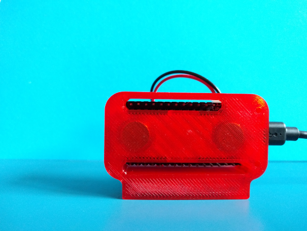

# Magnetic Feather Case

A magnetic battery case for Adafruit's Feather series. Flexible enough to use for development and short deployments.

### Features

* Compartment for a 350mAh LiPoly battery (with zip-tie strain relief slots)

* Slot for a rare earth badge magnet (source provided)

* Support for Adafruit's stackable Feather wings

* Cable management / routing slots

* Upside down board support (lightly tested)

### Materials

#### Feather + Screws

* 1x Adafruit Feather (ESP8266, Bluefruit, ESP32, Adalogger 32u4 were used during prototyping/building)

* 2x M2.5 x 6mm socket head cap screw (up to 12mm length should work too, but is untested -- one screw per case also works too)

#### Battery

* 1x Lithium Ion Polymer Battery - 3.7v 350mAh 552035 - [PKCell 552035, Adafruit](https://www.adafruit.com/product/2750). There are shipping restrictions on lithium polymer batteries, so a local source with the same model/dimensions might be more suitable.

#### Magnet

* 1x Badge Magnet - [Amazon 10-pack](https://www.amazon.com/totalElement-Magnetic-Fastener-Adhesive-10-Pack/dp/B00EHK287M) -- the one [sold by Adafruit is tested as well](https://www.adafruit.com/product/1170)

* 1x 1.75mm filament, cut to length for the magnet retainer slot

* Glue/epoxy (optional) to fix the filament in place

### Assembly

After printing all three parts, place the LiPoly battery in first. The battery wiring can be routed through the case, and looped up to the Feather's JST header. If desired, add a small zip tie (for a bit of strain relief) on the front of the case.

The badge magnet goes into the case with the warning symbols facing up. Insert the cut filament and glue (if desired) into the retainer slot.

Finally, add the Feather PCBA into the case, ensuring the board seats into the case's rear notches fully. Carefully press the board down in front. Screw the Feather down in front with a M2.5 hex screw. The LEDs will be in close proximity to the screw heads, but should not interfere.

Attach the button to the lid. It requires a bit of force.

### Photos

Assembled case with a Feather and Feather wing attached. The battery wiring is routed through the case, past a point where a small zip tie can be used to fix the wires in place.

After exiting the bottom of the case, the wiring can be routed back up into the JST header. The slot for the JST connector is spaced (with the cover off) for access with two fingers. With a Wing attached, access is a bit more restricted. For now, the cover (and any attached wings), will need to be removed for access to the JST plug.

Depending on the Feather/PCB, it may be possible to use a Feather "upside down" for prototyping -- Feathers have different layouts and construction, so inspect the case and Feather's tolerances before trying.

There is no cover for this configuration -- the JST jack is also obstructed.

In most configurations, only one hex screw is needed. Tighten carefully, as neighboring parts are sometimes a whisker's width away.

### Using the Enable Pin To Disconnect Power

On the ESP32: Nominal consumption with the default program (which scans for SSIDs) is around 130mA (burst). With the enable pin pulled low, quiescent power consumption is around 100μA.

With a full battery, using the enable pin to limit consumption drains a 350 mAh battery in about 100 days (optimisic estimate with an adjustment factor of 0.7).

### Fin

More resources:

* [Adafruit's ESP32 Documentation](https://learn.adafruit.com/adafruit-huzzah32-esp32-feather/overview)

* [Adafruit's ESP8266 Documentation](https://learn.adafruit.com/adafruit-feather-huzzah-esp8266/)

* [Adafruit's Feather Series](https://www.adafruit.com/feather/)